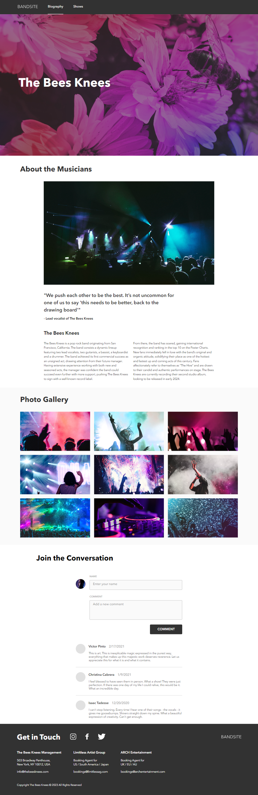
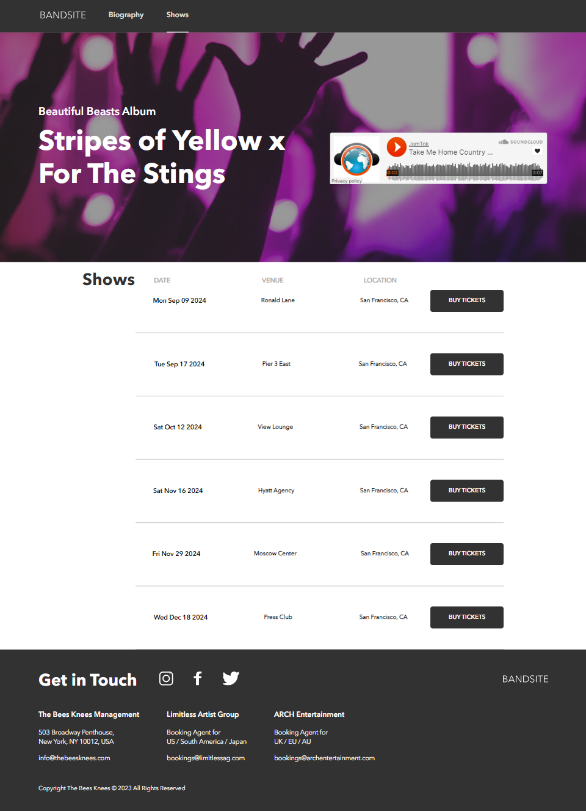

# Bandsite Website

## Project Overview

BandSite is a fully functional and responsive website created for an up-and-coming band. The project was developed over three sprints, each with specific deliverables and improvements. The website was built using HTML, Sass, JavaScript, and integrated with an API for dynamic content. The website provides information about the band, allows users to comment on the band’s bio page, and view upcoming shows.

---

### Features

- **Responsive Design**: The website is fully responsive and works across different screen sizes (mobile-first approach).
- **Comments Section**: Users can view and post comments on the band's bio page. New comments are dynamically added and displayed without reloading the page.
- **Shows Page**: Displays upcoming shows with details fetched from an API.
- **Audio Playback**: The shows page includes a song that can be played using SoundCloud.
- **JavaScript Interactivity**: Various interactive elements, such as comment posting and dynamic display of shows, are powered by JavaScript.

---

## Sprints Breakdown

### Sprint 1: Responsive Website Design

In this sprint, the focus was on creating a responsive and mobile-first website based on provided mockups and design specifications.

- **Tools**: HTML, Sass (for CSS styling), Flexbox (for layout).
- **Features**:
  - Responsive design using Sass and Flexbox.
  - Navigation with a clickable logo that redirects users to the home page.
  - Mobile-first design principles with responsiveness from 320px to 1920px.

### Sprint 2: Adding Interactivity with JavaScript

In Sprint 2, we added interactivity to the site using JavaScript and introduced a new page (Shows Page).

- **Tools**: JavaScript, DOM Manipulation.
- **Features**:
  - **Comments Section**: A comment section where users can add their name and comment.
  - **Dynamic Comments**: Displayed using JavaScript DOM manipulation with the newest comments appearing at the top.
  - **Shows Page**: Rendered dynamically with JavaScript, including song playback using SoundCloud.
  - **Hover and Click Interactivity**: Show items on the Shows Page respond to hover and click events with specific styling.

### Sprint 3: API Integration

Sprint 3 integrated the site with an external API for dynamic content retrieval, including live data for comments and upcoming shows.

- **Tools**: Axios, JavaScript (ES6), API.
- **Features**:
  - **API Integration**: Comments and show data are fetched from an external API using Axios.
  - **Post Comments to API**: Users can add comments that are sent to the server and stored.
  - **Shows from API**: The shows data on the Shows Page is retrieved from the API and displayed dynamically.
  - **Optimized Comment Display**: Comments are displayed in descending order (newest first).

---

## Tech Stack

- **HTML5**
- **CSS3 (Sass)**
- **JavaScript (ES6)**
- **Flexbox for Layout**
- **API Integration with Axios**
- **Responsive Design (Mobile-First)**

## Screenshots

- **Biography Page**

    

- **Shows Page**

    